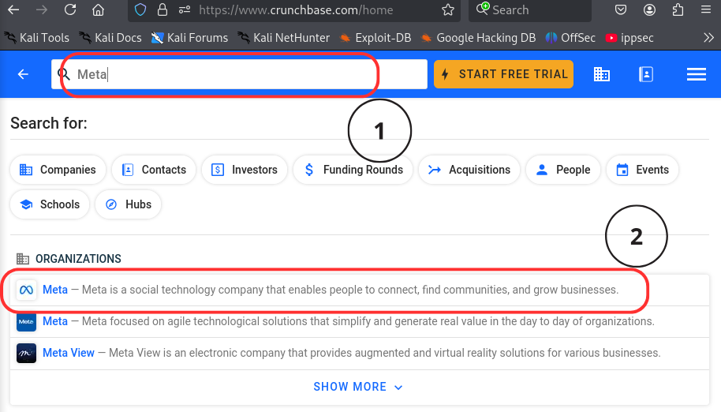
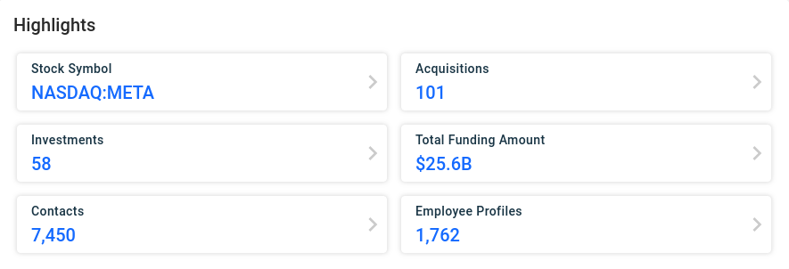

# Meta
---
Meta platforms, Inc., Formerly known as Facebook, is an American multinational technology conglomerate based in Menlo Park, California.

---

## Passive Recon

<ins><b>Acquisition</b></ins>
> Tools/platforms that I used to bring out companies acquired by Meta
- [Crunchbase](https://www.crunchbase.com/home) 
&emsp;Crunchbase is a comprehensive platform and database, thus I am using this to get the acquisitions of an organisation.

    - Steps to produce:
<table>
  <tr>
    <td></td>
    <td>
      
First go to <a href="https://www.crunchbase.com/home">Crunchbase</a> and at the top of the website there is a search bar where you can enter the target and hit enter to execute the search query.

    </td>
  </tr>
</table>

<table>
  <tr>
    <td>
      
If the intended target organisation is found then click on it and look for highlight

    </td>
    <td></td>
  </tr>
</table>

| Company Name           | Acquisition Date  |
|------------------------|-------------------|
| Gary Sharp Innovations | Jan 12, 2023      |
| Luxexcel               | Dec 30, 2022      |
| Camouflaj              | Oct 11, 2022      |
| Armature Studio        | Oct 11, 2022      |
| Twisted Pixel Games    | Oct 11, 2022      |
| Lofelt                 | Sep 2, 2022       |
| presize.ai             | Apr 14, 2022      |
| ImagineOptix           | Dec 21, 2021      |
| Within (VR/AR)         | Oct 29, 2021      |
| AI.Reverie             | Oct 12, 2021      |

